# [📈 Live Status](https://upptime.github.io/upptime): <!--live status--> **🟩 All systems operational**

This repository contains the open-source uptime monitor and status page for [Upptime](https://upptime.js.org), powered by [Upptime](https://github.com/upptime/upptime).

With [Upptime](https://upptime.js.org), you can get your own unlimited and free uptime monitor and status page, powered entirely by a GitHub repository. We use [Issues](https://github.com/upptime/upptime/issues) as incident reports, [Actions](https://github.com/FP-Design-Code/uptime/actions) as uptime monitors, and [Pages](https://upptime.github.io/upptime) for the status page.

<!--start: status pages-->
<!-- This summary is generated by Upptime (https://github.com/upptime/upptime) -->
<!-- Do not edit this manually, your changes will be overwritten -->
<!-- prettier-ignore -->
| URL | Status | History | Response Time | Uptime |
| --- | ------ | ------- | ------------- | ------ |
|  [Server](https://ded.floating-point.com) | 🟩 Up | [server.yml](https://github.com/FP-Design-Code/uptime/commits/HEAD/history/server.yml) | 

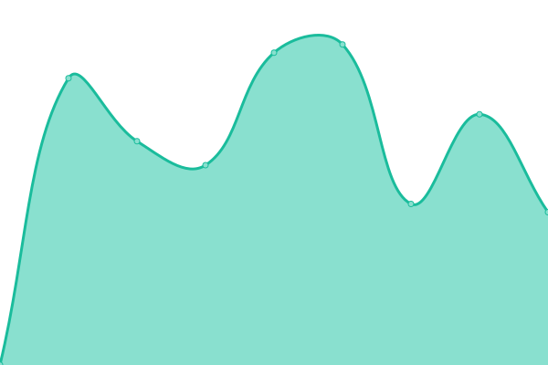 705ms
     
 | 

<a href="https://FP-Design-Code.github.io/uptime/history/server">100.00%</a>
    

|  [ACML](https://acml.ca) | 🟩 Up | [acml.yml](https://github.com/FP-Design-Code/uptime/commits/HEAD/history/acml.yml) | 

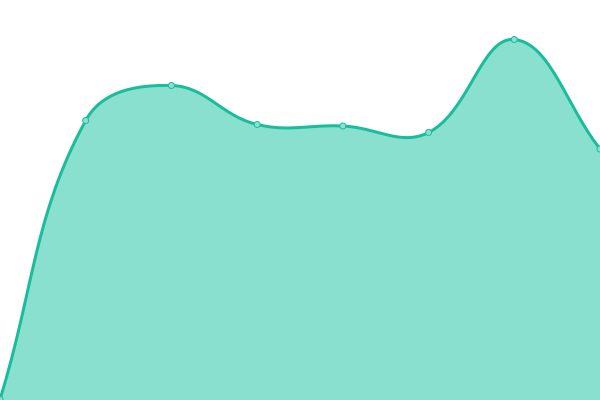 608ms
     
 | 

<a href="https://FP-Design-Code.github.io/uptime/history/acml">100.00%</a>
    

|  [AMHSHPE](https://hopedreamrecover.ca) | 🟩 Up | [amhshpe.yml](https://github.com/FP-Design-Code/uptime/commits/HEAD/history/amhshpe.yml) | 

 1161ms
     
 | 

<a href="https://FP-Design-Code.github.io/uptime/history/amhshpe">100.00%</a>
    

|  [AMHSKFLA](https://amhs-kfla.ca) | 🟩 Up | [amhskfla.yml](https://github.com/FP-Design-Code/uptime/commits/HEAD/history/amhskfla.yml) | 

 1850ms
     
 | 

<a href="https://FP-Design-Code.github.io/uptime/history/amhskfla">98.34%</a>
    

|  [Angus Systems](https://angus-systems.com) | 🟩 Up | [angus-systems.yml](https://github.com/FP-Design-Code/uptime/commits/HEAD/history/angus-systems.yml) | 

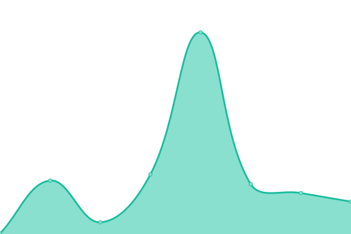 1205ms
     
 | 

<a href="https://FP-Design-Code.github.io/uptime/history/angus-systems">100.00%</a>
    

|  [Arnon](https://arnon.ca) | 🟩 Up | [arnon.yml](https://github.com/FP-Design-Code/uptime/commits/HEAD/history/arnon.yml) | 

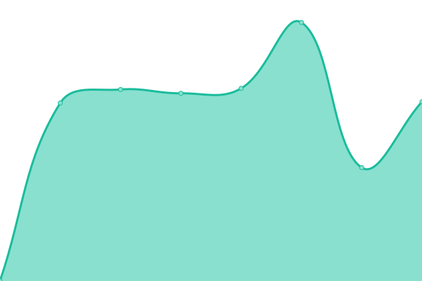 1105ms
     
 | 

<a href="https://FP-Design-Code.github.io/uptime/history/arnon">0.00%</a>
    

|  [Aylmer](https://aylmer.ca) | 🟩 Up | [aylmer.yml](https://github.com/FP-Design-Code/uptime/commits/HEAD/history/aylmer.yml) | 

 270ms
     
 | 

<a href="https://FP-Design-Code.github.io/uptime/history/aylmer">100.00%</a>
    

|  [Belleville on Bikes](https://bellevilleonbikes.ca) | 🟩 Up | [belleville-on-bikes.yml](https://github.com/FP-Design-Code/uptime/commits/HEAD/history/belleville-on-bikes.yml) | 

 698ms
     
 | 

<a href="https://FP-Design-Code.github.io/uptime/history/belleville-on-bikes">100.00%</a>
    

|  [Bigelow Liptak](https://bigelow-liptak.com) | 🟩 Up | [bigelow-liptak.yml](https://github.com/FP-Design-Code/uptime/commits/HEAD/history/bigelow-liptak.yml) | 

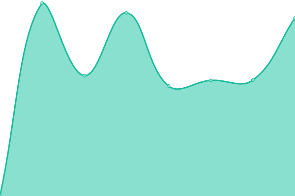 647ms
     
 | 

<a href="https://FP-Design-Code.github.io/uptime/history/bigelow-liptak">100.00%</a>
    

|  [Blachford](https://blachford.com) | 🟩 Up | [blachford.yml](https://github.com/FP-Design-Code/uptime/commits/HEAD/history/blachford.yml) | 

 468ms
     
 | 

<a href="https://FP-Design-Code.github.io/uptime/history/blachford">100.00%</a>
    

|  [Blachford Acoustics](https://blachfordacoustics.com) | 🟩 Up | [blachford-acoustics.yml](https://github.com/FP-Design-Code/uptime/commits/HEAD/history/blachford-acoustics.yml) | 

 521ms
     
 | 

<a href="https://FP-Design-Code.github.io/uptime/history/blachford-acoustics">100.00%</a>
    

|  [Blachford Chemical Specialties](https://blachfordcs.com) | 🟩 Up | [blachford-chemical-specialties.yml](https://github.com/FP-Design-Code/uptime/commits/HEAD/history/blachford-chemical-specialties.yml) | 

 515ms
     
 | 

<a href="https://FP-Design-Code.github.io/uptime/history/blachford-chemical-specialties">0.00%</a>
    

|  [Blachford Metal Working](https://blachfordmetalworking.com) | 🟩 Up | [blachford-metal-working.yml](https://github.com/FP-Design-Code/uptime/commits/HEAD/history/blachford-metal-working.yml) | 

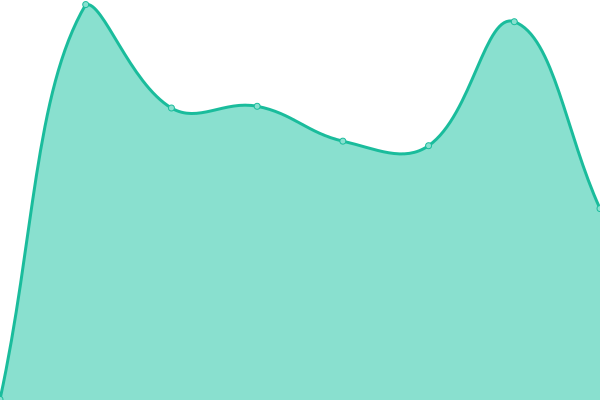 607ms
     
 | 

<a href="https://FP-Design-Code.github.io/uptime/history/blachford-metal-working">100.00%</a>
    

|  [BridgeWay](https://bridgewaycentre.ca) | 🟩 Up | [bridge-way.yml](https://github.com/FP-Design-Code/uptime/commits/HEAD/history/bridge-way.yml) | 

 1019ms
     
 | 

<a href="https://FP-Design-Code.github.io/uptime/history/bridge-way">100.00%</a>
    

|  [Campaign 2000](https://campaign2000.ca) | 🟩 Up | [campaign-2000.yml](https://github.com/FP-Design-Code/uptime/commits/HEAD/history/campaign-2000.yml) | 

 1265ms
     
 | 

<a href="https://FP-Design-Code.github.io/uptime/history/campaign-2000">100.00%</a>
    

|  [Canta Arya](https://cantaaryastrings.com) | 🟩 Up | [canta-arya.yml](https://github.com/FP-Design-Code/uptime/commits/HEAD/history/canta-arya.yml) | 

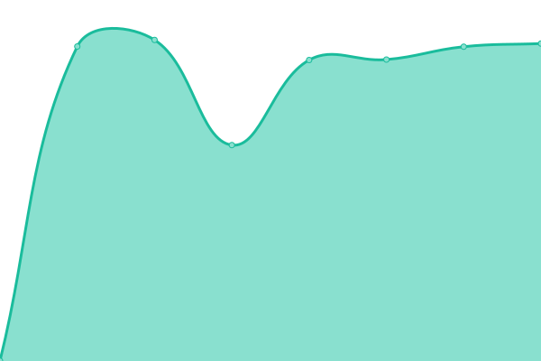 1317ms
     
 | 

<a href="https://FP-Design-Code.github.io/uptime/history/canta-arya">100.00%</a>
    

|  [CD Nova](https://cdnova.com) | 🟩 Up | [cd-nova.yml](https://github.com/FP-Design-Code/uptime/commits/HEAD/history/cd-nova.yml) | 

 606ms
     
 | 

<a href="https://FP-Design-Code.github.io/uptime/history/cd-nova">100.00%</a>
    

|  [CHEC Energy](https://checenergy.ca) | 🟩 Up | [chec-energy.yml](https://github.com/FP-Design-Code/uptime/commits/HEAD/history/chec-energy.yml) | 

 937ms
     
 | 

<a href="https://FP-Design-Code.github.io/uptime/history/chec-energy">100.00%</a>
    

|  [CHFHT](https://chfht.ca) | 🟩 Up | [chfht.yml](https://github.com/FP-Design-Code/uptime/commits/HEAD/history/chfht.yml) | 

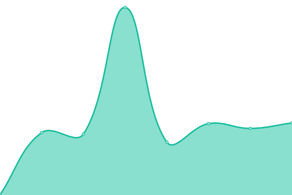 700ms
     
 | 

<a href="https://FP-Design-Code.github.io/uptime/history/chfht">100.00%</a>
    

|  [CICC](https://cicc.ca) | 🟩 Up | [cicc.yml](https://github.com/FP-Design-Code/uptime/commits/HEAD/history/cicc.yml) | 

 1153ms
     
 | 

<a href="https://FP-Design-Code.github.io/uptime/history/cicc">100.00%</a>
    

|  [Contacts](https://contacts.floating-point.com) | 🟩 Up | [contacts.yml](https://github.com/FP-Design-Code/uptime/commits/HEAD/history/contacts.yml) | 

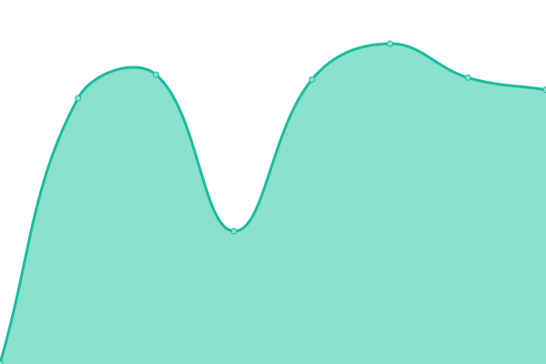 416ms
     
 | 

<a href="https://FP-Design-Code.github.io/uptime/history/contacts">100.00%</a>
    

|  [Custom Plastics](https://customplastics.ca) | 🟩 Up | [custom-plastics.yml](https://github.com/FP-Design-Code/uptime/commits/HEAD/history/custom-plastics.yml) | 

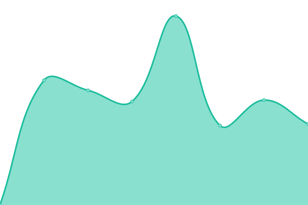 950ms
     
 | 

<a href="https://FP-Design-Code.github.io/uptime/history/custom-plastics">100.00%</a>
    

|  [Daytech Limited](https://daytechlimited.com) | 🟩 Up | [daytech-limited.yml](https://github.com/FP-Design-Code/uptime/commits/HEAD/history/daytech-limited.yml) | 

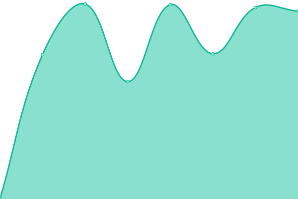 1219ms
     
 | 

<a href="https://FP-Design-Code.github.io/uptime/history/daytech-limited">100.00%</a>
    

|  [DCAFS](https://dcafs.on.ca) | 🟩 Up | [dcafs.yml](https://github.com/FP-Design-Code/uptime/commits/HEAD/history/dcafs.yml) | 

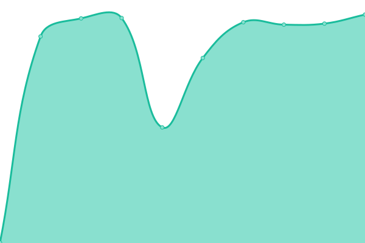 587ms
     
 | 

<a href="https://FP-Design-Code.github.io/uptime/history/dcafs">100.00%</a>
    

|  [Desert Stream](https://desertstream.net) | 🟩 Up | [desert-stream.yml](https://github.com/FP-Design-Code/uptime/commits/HEAD/history/desert-stream.yml) | 

 1172ms
     
 | 

<a href="https://FP-Design-Code.github.io/uptime/history/desert-stream">100.00%</a>
    

|  [EECC](https://eastelgincommunitycomplex.ca) | 🟩 Up | [eecc.yml](https://github.com/FP-Design-Code/uptime/commits/HEAD/history/eecc.yml) | 

 631ms
     
 | 

<a href="https://FP-Design-Code.github.io/uptime/history/eecc">100.00%</a>
    

|  [Elevate Plus](https://elevateplus.ca) | 🟩 Up | [elevate-plus.yml](https://github.com/FP-Design-Code/uptime/commits/HEAD/history/elevate-plus.yml) | 

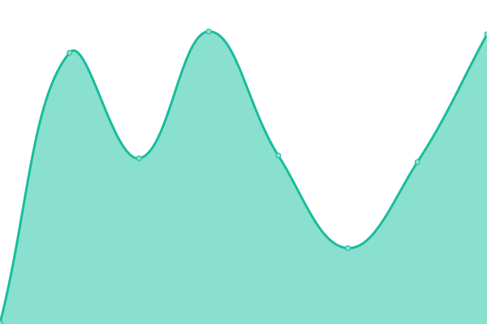 245ms
     
 | 

<a href="https://FP-Design-Code.github.io/uptime/history/elevate-plus">100.00%</a>
    

|  [Face the Future](https://facethefuturefoundation.ca) | 🟩 Up | [face-the-future.yml](https://github.com/FP-Design-Code/uptime/commits/HEAD/history/face-the-future.yml) | 

 1137ms
     
 | 

<a href="https://FP-Design-Code.github.io/uptime/history/face-the-future">100.00%</a>
    

|  [FST](https://familyservicetoronto.org) | 🟩 Up | [fst.yml](https://github.com/FP-Design-Code/uptime/commits/HEAD/history/fst.yml) | 

 1527ms
     
 | 

<a href="https://FP-Design-Code.github.io/uptime/history/fst">100.00%</a>
    

|  [FCS Renfrew](https://fcsrenfrew.on.ca) | 🟩 Up | [fcs-renfrew.yml](https://github.com/FP-Design-Code/uptime/commits/HEAD/history/fcs-renfrew.yml) | 

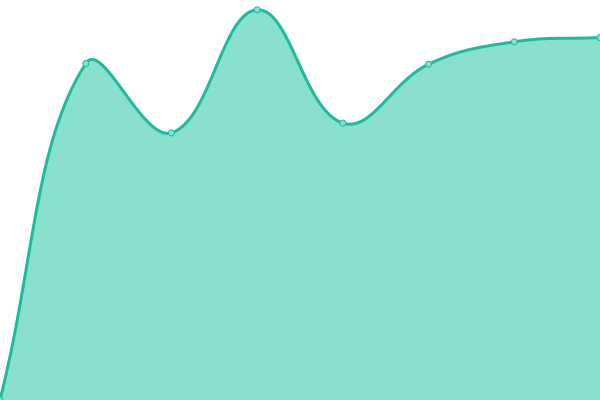 1341ms
     
 | 

<a href="https://FP-Design-Code.github.io/uptime/history/fcs-renfrew">100.00%</a>
    

|  [Floating-Point](https://floating-point.com) | 🟩 Up | [floating-point.yml](https://github.com/FP-Design-Code/uptime/commits/HEAD/history/floating-point.yml) | 

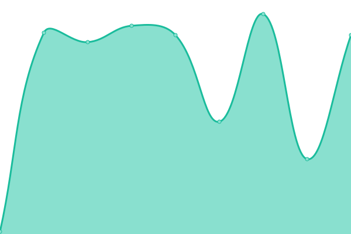 116ms
     
 | 

<a href="https://FP-Design-Code.github.io/uptime/history/floating-point">100.00%</a>
    

|  [Frontenac Islands](https://frontenacislands.ca) | 🟩 Up | [frontenac-islands.yml](https://github.com/FP-Design-Code/uptime/commits/HEAD/history/frontenac-islands.yml) | 

 881ms
     
 | 

<a href="https://FP-Design-Code.github.io/uptime/history/frontenac-islands">100.00%</a>
    

|  [FSP](https://fspeel.org) | 🟩 Up | [fsp.yml](https://github.com/FP-Design-Code/uptime/commits/HEAD/history/fsp.yml) | 

 776ms
     
 | 

<a href="https://FP-Design-Code.github.io/uptime/history/fsp">100.00%</a>
    

|  [FSYR](https://fsyr.ca) | 🟩 Up | [fsyr.yml](https://github.com/FP-Design-Code/uptime/commits/HEAD/history/fsyr.yml) | 

 1449ms
     
 | 

<a href="https://FP-Design-Code.github.io/uptime/history/fsyr">100.00%</a>
    

|  [Humber Nurseries](https://gardencentre.com) | 🟩 Up | [humber-nurseries.yml](https://github.com/FP-Design-Code/uptime/commits/HEAD/history/humber-nurseries.yml) | 

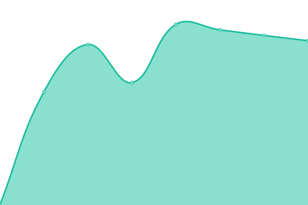 495ms
     
 | 

<a href="https://FP-Design-Code.github.io/uptime/history/humber-nurseries">100.00%</a>
    

|  [Giffin Canada](https://giffincanada.com) | 🟩 Up | [giffin-canada.yml](https://github.com/FP-Design-Code/uptime/commits/HEAD/history/giffin-canada.yml) | 

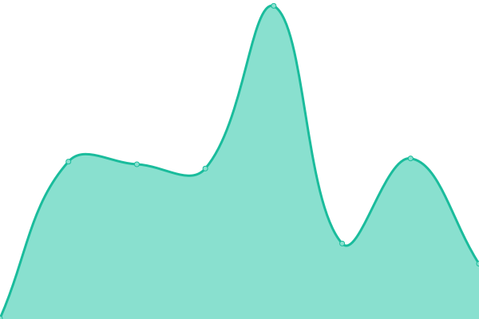 755ms
     
 | 

<a href="https://FP-Design-Code.github.io/uptime/history/giffin-canada">100.00%</a>
    

|  [Gilad Parking](https://giladparking.com) | 🟩 Up | [gilad-parking.yml](https://github.com/FP-Design-Code/uptime/commits/HEAD/history/gilad-parking.yml) | 

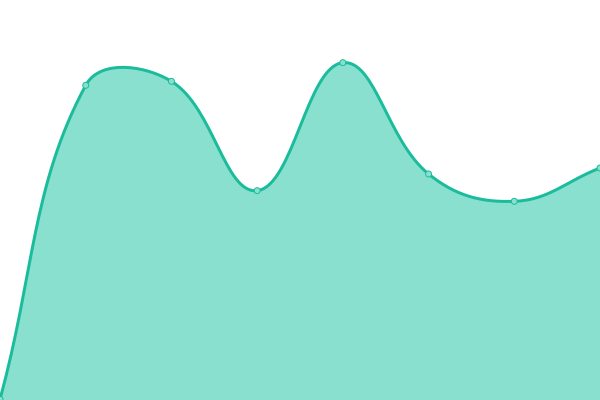 447ms
     
 | 

<a href="https://FP-Design-Code.github.io/uptime/history/gilad-parking">100.00%</a>
    

|  [Gillanders](https://gillanders.com) | 🟩 Up | [gillanders.yml](https://github.com/FP-Design-Code/uptime/commits/HEAD/history/gillanders.yml) | 

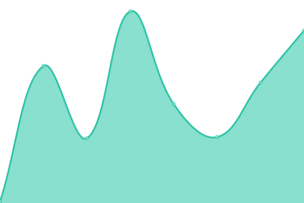 984ms
     
 | 

<a href="https://FP-Design-Code.github.io/uptime/history/gillanders">100.00%</a>
    

|  [Global Med Inc](https://globalmedinc.com) | 🟩 Up | [global-med-inc.yml](https://github.com/FP-Design-Code/uptime/commits/HEAD/history/global-med-inc.yml) | 

 1464ms
     
 | 

<a href="https://FP-Design-Code.github.io/uptime/history/global-med-inc">100.00%</a>
    

|  [Hastings County](https://hastingscounty.com) | 🟩 Up | [hastings-county.yml](https://github.com/FP-Design-Code/uptime/commits/HEAD/history/hastings-county.yml) | 

 607ms
     
 | 

<a href="https://FP-Design-Code.github.io/uptime/history/hastings-county">100.00%</a>
    

|  [Hastings Highlands](https://hastingshighlands.ca) | 🟩 Up | [hastings-highlands.yml](https://github.com/FP-Design-Code/uptime/commits/HEAD/history/hastings-highlands.yml) | 

 1149ms
     
 | 

<a href="https://FP-Design-Code.github.io/uptime/history/hastings-highlands">100.00%</a>
    

|  [HBPA](https://hbpa.on.ca) | 🟩 Up | [hbpa.yml](https://github.com/FP-Design-Code/uptime/commits/HEAD/history/hbpa.yml) | 

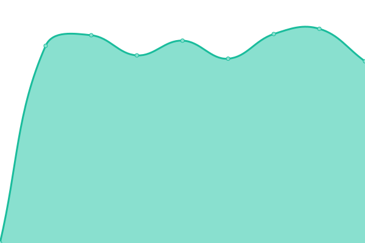 1254ms
     
 | 

<a href="https://FP-Design-Code.github.io/uptime/history/hbpa">100.00%</a>
    

|  [LGLDHU](https://healthunit.org) | 🟩 Up | [lgldhu.yml](https://github.com/FP-Design-Code/uptime/commits/HEAD/history/lgldhu.yml) | 

 926ms
     
 | 

<a href="https://FP-Design-Code.github.io/uptime/history/lgldhu">100.00%</a>
    

|  [Isaiah Tubbs](https://isaiahtubbs.com) | 🟩 Up | [isaiah-tubbs.yml](https://github.com/FP-Design-Code/uptime/commits/HEAD/history/isaiah-tubbs.yml) | 

 557ms
     
 | 

<a href="https://FP-Design-Code.github.io/uptime/history/isaiah-tubbs">100.00%</a>
    

|  [ITL Circuits](https://itlcircuits.com) | 🟩 Up | [itl-circuits.yml](https://github.com/FP-Design-Code/uptime/commits/HEAD/history/itl-circuits.yml) | 

 695ms
     
 | 

<a href="https://FP-Design-Code.github.io/uptime/history/itl-circuits">100.00%</a>
    

|  [KCHC](https://kchc.ca) | 🟩 Up | [kchc.yml](https://github.com/FP-Design-Code/uptime/commits/HEAD/history/kchc.yml) | 

 739ms
     
 | 

<a href="https://FP-Design-Code.github.io/uptime/history/kchc">100.00%</a>
    

|  [Kollage Square](https://kollagesquare.com) | 🟩 Up | [kollage-square.yml](https://github.com/FP-Design-Code/uptime/commits/HEAD/history/kollage-square.yml) | 

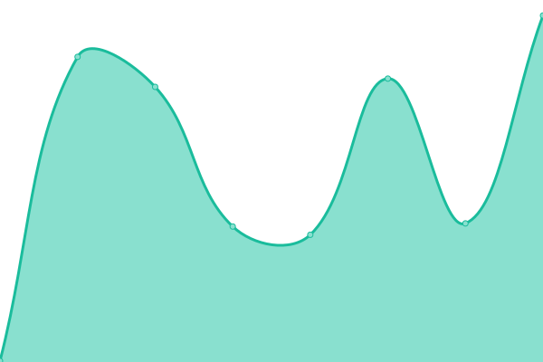 257ms
     
 | 

<a href="https://FP-Design-Code.github.io/uptime/history/kollage-square">100.00%</a>
    

|  [Lime Rentals](https://limerentals.ca) | 🟩 Up | [lime-rentals.yml](https://github.com/FP-Design-Code/uptime/commits/HEAD/history/lime-rentals.yml) | 

 237ms
     
 | 

<a href="https://FP-Design-Code.github.io/uptime/history/lime-rentals">100.00%</a>
    

|  [Links2Care](https://links2care.ca) | 🟩 Up | [links2-care.yml](https://github.com/FP-Design-Code/uptime/commits/HEAD/history/links2-care.yml) | 

 1315ms
     
 | 

<a href="https://FP-Design-Code.github.io/uptime/history/links2-care">100.00%</a>
    

|  [Living Well SEO](https://livingwellseontario.ca) | 🟩 Up | [living-well-seo.yml](https://github.com/FP-Design-Code/uptime/commits/HEAD/history/living-well-seo.yml) | 

 2024ms
     
 | 

<a href="https://FP-Design-Code.github.io/uptime/history/living-well-seo">100.00%</a>
    

|  [QEDC - MRC](https://manufacturingrc.ca) | 🟩 Up | [qedc-mrc.yml](https://github.com/FP-Design-Code/uptime/commits/HEAD/history/qedc-mrc.yml) | 

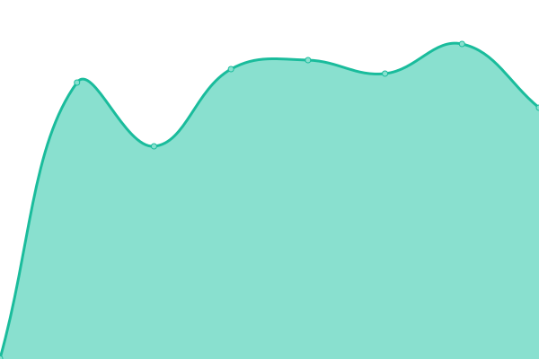 667ms
     
 | 

<a href="https://FP-Design-Code.github.io/uptime/history/qedc-mrc">100.00%</a>
    

|  [My Better Living](https://mybetterliving.ca) | 🟩 Up | [my-better-living.yml](https://github.com/FP-Design-Code/uptime/commits/HEAD/history/my-better-living.yml) | 

 738ms
     
 | 

<a href="https://FP-Design-Code.github.io/uptime/history/my-better-living">100.00%</a>
    

|  [My Hospice](https://myhospice.ca) | 🟩 Up | [my-hospice.yml](https://github.com/FP-Design-Code/uptime/commits/HEAD/history/my-hospice.yml) | 

 1168ms
     
 | 

<a href="https://FP-Design-Code.github.io/uptime/history/my-hospice">100.00%</a>
    

|  [Angus Newsroom](https://newsroom.angus-systems.com) | 🟩 Up | [angus-newsroom.yml](https://github.com/FP-Design-Code/uptime/commits/HEAD/history/angus-newsroom.yml) | 

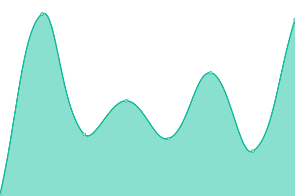 1184ms
     
 | 

<a href="https://FP-Design-Code.github.io/uptime/history/angus-newsroom">100.00%</a>
    

|  [Ontario Campaign 2000](https://ontariocampaign2000.ca) | 🟩 Up | [ontario-campaign-2000.yml](https://github.com/FP-Design-Code/uptime/commits/HEAD/history/ontario-campaign-2000.yml) | 

 1552ms
     
 | 

<a href="https://FP-Design-Code.github.io/uptime/history/ontario-campaign-2000">100.00%</a>
    

|  [Orillia Power Generation](https://orilliapowergeneration.ca) | 🟩 Up | [orillia-power-generation.yml](https://github.com/FP-Design-Code/uptime/commits/HEAD/history/orillia-power-generation.yml) | 

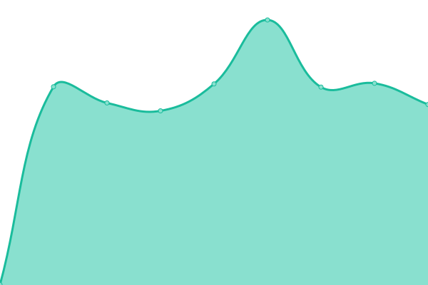 560ms
     
 | 

<a href="https://FP-Design-Code.github.io/uptime/history/orillia-power-generation">100.00%</a>
    

|  [ORPC](https://orpowercorp.com) | 🟩 Up | [orpc.yml](https://github.com/FP-Design-Code/uptime/commits/HEAD/history/orpc.yml) | 

 1659ms
     
 | 

<a href="https://FP-Design-Code.github.io/uptime/history/orpc">100.00%</a>
    

|  [Peak LTD](https://peakltd.ca) | 🟩 Up | [peak-ltd.yml](https://github.com/FP-Design-Code/uptime/commits/HEAD/history/peak-ltd.yml) | 

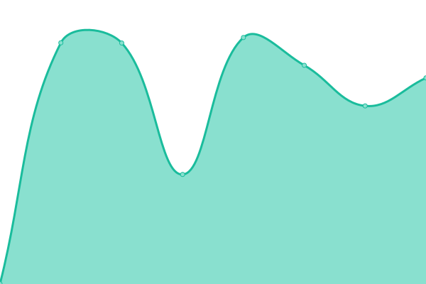 1208ms
     
 | 

<a href="https://FP-Design-Code.github.io/uptime/history/peak-ltd">100.00%</a>
    

|  [Profile Cutting Tech](https://profilecuttingtech.com) | 🟩 Up | [profile-cutting-tech.yml](https://github.com/FP-Design-Code/uptime/commits/HEAD/history/profile-cutting-tech.yml) | 

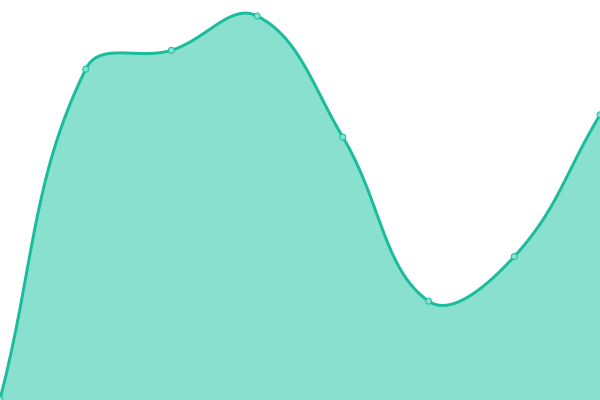 621ms
     
 | 

<a href="https://FP-Design-Code.github.io/uptime/history/profile-cutting-tech">100.00%</a>
    

|  [PWRDF](https://pwrdf.org) | 🟩 Up | [pwrdf.yml](https://github.com/FP-Design-Code/uptime/commits/HEAD/history/pwrdf.yml) | 

 765ms
     
 | 

<a href="https://FP-Design-Code.github.io/uptime/history/pwrdf">100.00%</a>
    

|  [QBDC](https://qbdc.ca) | 🟩 Up | [qbdc.yml](https://github.com/FP-Design-Code/uptime/commits/HEAD/history/qbdc.yml) | 

 765ms
     
 | 

<a href="https://FP-Design-Code.github.io/uptime/history/qbdc">100.00%</a>
    

|  [Quinte Boat Docks](https://quinteboatdocks.com) | 🟩 Up | [quinte-boat-docks.yml](https://github.com/FP-Design-Code/uptime/commits/HEAD/history/quinte-boat-docks.yml) | 

 812ms
     
 | 

<a href="https://FP-Design-Code.github.io/uptime/history/quinte-boat-docks">100.00%</a>
    

|  [QEDC](https://quintedevelopment.com) | 🟩 Up | [qedc.yml](https://github.com/FP-Design-Code/uptime/commits/HEAD/history/qedc.yml) | 

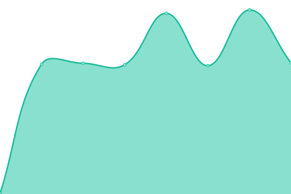 698ms
     
 | 

<a href="https://FP-Design-Code.github.io/uptime/history/qedc">100.00%</a>
    

|  [Quinte Masonry](https://quintemasonry.com) | 🟩 Up | [quinte-masonry.yml](https://github.com/FP-Design-Code/uptime/commits/HEAD/history/quinte-masonry.yml) | 

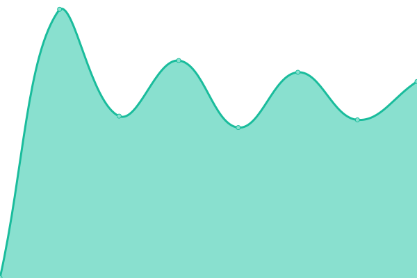 671ms
     
 | 

<a href="https://FP-Design-Code.github.io/uptime/history/quinte-masonry">100.00%</a>
    

|  [Quinte Recycling](https://quinterecycling.org) | 🟩 Up | [quinte-recycling.yml](https://github.com/FP-Design-Code/uptime/commits/HEAD/history/quinte-recycling.yml) | 

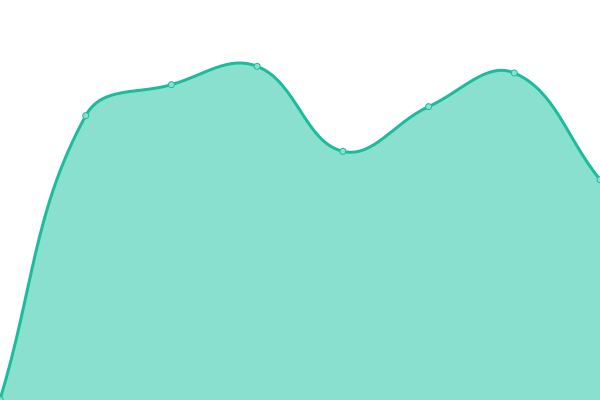 936ms
     
 | 

<a href="https://FP-Design-Code.github.io/uptime/history/quinte-recycling">100.00%</a>
    

|  [RECL](https://recl.ca) | 🟩 Up | [recl.yml](https://github.com/FP-Design-Code/uptime/commits/HEAD/history/recl.yml) | 

 646ms
     
 | 

<a href="https://FP-Design-Code.github.io/uptime/history/recl">100.00%</a>
    

|  [RMC Club](https://rmcclub.ca) | 🟩 Up | [rmc-club.yml](https://github.com/FP-Design-Code/uptime/commits/HEAD/history/rmc-club.yml) | 

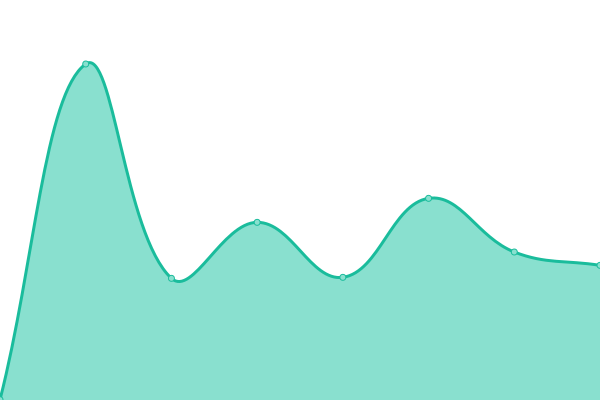 588ms
     
 | 

<a href="https://FP-Design-Code.github.io/uptime/history/rmc-club">100.00%</a>
    

|  [Roger Snowball](https://rwsnowball.com) | 🟩 Up | [roger-snowball.yml](https://github.com/FP-Design-Code/uptime/commits/HEAD/history/roger-snowball.yml) | 

 660ms
     
 | 

<a href="https://FP-Design-Code.github.io/uptime/history/roger-snowball">100.00%</a>
    

|  [SFP](https://scottforestproducts.com) | 🟩 Up | [sfp.yml](https://github.com/FP-Design-Code/uptime/commits/HEAD/history/sfp.yml) | 

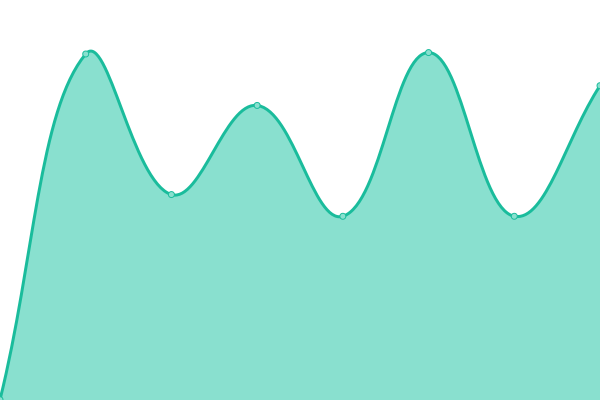 974ms
     
 | 

<a href="https://FP-Design-Code.github.io/uptime/history/sfp">100.00%</a>
    

|  [Semple Gooder](https://semplegooder.com) | 🟩 Up | [semple-gooder.yml](https://github.com/FP-Design-Code/uptime/commits/HEAD/history/semple-gooder.yml) | 

 688ms
     
 | 

<a href="https://FP-Design-Code.github.io/uptime/history/semple-gooder">100.00%</a>
    

|  [Snowball Photography](https://snowballphotography.net) | 🟩 Up | [snowball-photography.yml](https://github.com/FP-Design-Code/uptime/commits/HEAD/history/snowball-photography.yml) | 

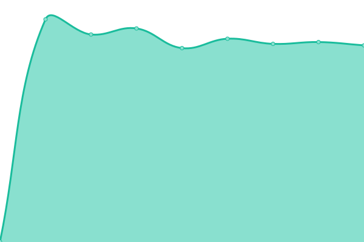 654ms
     
 | 

<a href="https://FP-Design-Code.github.io/uptime/history/snowball-photography">100.00%</a>
    

|  [SGBCHC](https://southgeorgianbaychc.ca) | 🟩 Up | [sgbchc.yml](https://github.com/FP-Design-Code/uptime/commits/HEAD/history/sgbchc.yml) | 

 1187ms
     
 | 

<a href="https://FP-Design-Code.github.io/uptime/history/sgbchc">100.00%</a>
    

|  [Syntron Iris Valves](https://syntronirisvalves.com) | 🟩 Up | [syntron-iris-valves.yml](https://github.com/FP-Design-Code/uptime/commits/HEAD/history/syntron-iris-valves.yml) | 

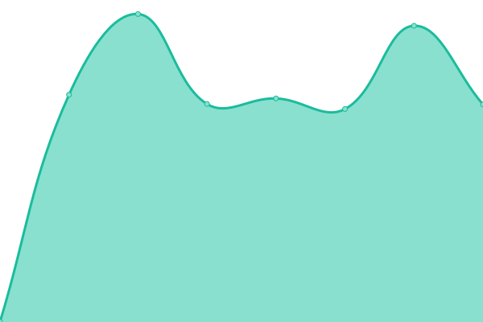 1179ms
     
 | 

<a href="https://FP-Design-Code.github.io/uptime/history/syntron-iris-valves">100.00%</a>
    

|  [The Big If](https://thebigif.ca) | 🟩 Up | [the-big-if.yml](https://github.com/FP-Design-Code/uptime/commits/HEAD/history/the-big-if.yml) | 

 162ms
     
 | 

<a href="https://FP-Design-Code.github.io/uptime/history/the-big-if">100.00%</a>
    

|  [The Spah](https://thespah.ca) | 🟩 Up | [the-spah.yml](https://github.com/FP-Design-Code/uptime/commits/HEAD/history/the-spah.yml) | 

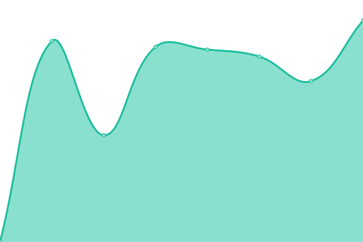 558ms
     
 | 

<a href="https://FP-Design-Code.github.io/uptime/history/the-spah">100.00%</a>
    

|  [Upper Canada Stone](https://uppercanadastone.com) | 🟩 Up | [upper-canada-stone.yml](https://github.com/FP-Design-Code/uptime/commits/HEAD/history/upper-canada-stone.yml) | 

 983ms
     
 | 

<a href="https://FP-Design-Code.github.io/uptime/history/upper-canada-stone">100.00%</a>
    

|  [Vanier](https://vanier.com) | 🟩 Up | [vanier.yml](https://github.com/FP-Design-Code/uptime/commits/HEAD/history/vanier.yml) | 

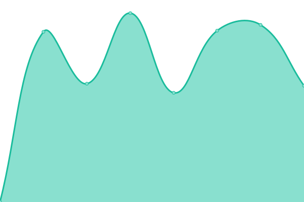 1269ms
     
 | 

<a href="https://FP-Design-Code.github.io/uptime/history/vanier">100.00%</a>
    

|  [Wasaga Distribution](https://wasagadist.ca) | 🟩 Up | [wasaga-distribution.yml](https://github.com/FP-Design-Code/uptime/commits/HEAD/history/wasaga-distribution.yml) | 

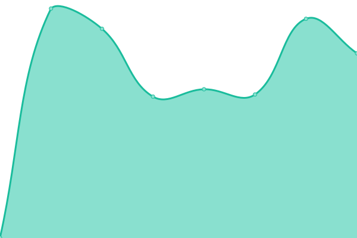 811ms
     
 | 

<a href="https://FP-Design-Code.github.io/uptime/history/wasaga-distribution">100.00%</a>
    

|  [We Jay](https://wejay.com) | 🟩 Up | [we-jay.yml](https://github.com/FP-Design-Code/uptime/commits/HEAD/history/we-jay.yml) | 

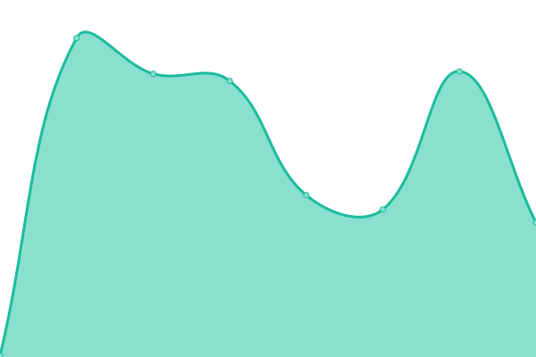 314ms
     
 | 

<a href="https://FP-Design-Code.github.io/uptime/history/we-jay">100.00%</a>
    

|  [Welland Hydro](https://wellandhydro.com) | 🟩 Up | [welland-hydro.yml](https://github.com/FP-Design-Code/uptime/commits/HEAD/history/welland-hydro.yml) | 

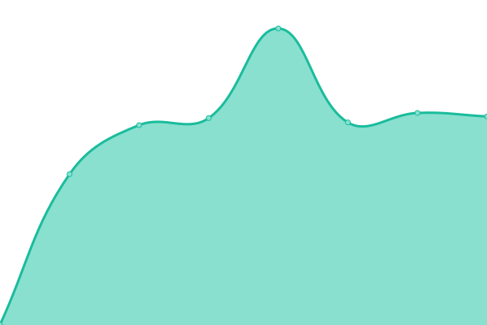 788ms
     
 | 

<a href="https://FP-Design-Code.github.io/uptime/history/welland-hydro">100.00%</a>
    

|  [Westario Power](https://westario.com) | 🟩 Up | [westario-power.yml](https://github.com/FP-Design-Code/uptime/commits/HEAD/history/westario-power.yml) | 

 790ms
     
 | 

<a href="https://FP-Design-Code.github.io/uptime/history/westario-power">100.00%</a>
    

|  [YBIQ](https://yourbusinessinquinte.com) | 🟩 Up | [ybiq.yml](https://github.com/FP-Design-Code/uptime/commits/HEAD/history/ybiq.yml) | 

 433ms
     
 | 

<a href="https://FP-Design-Code.github.io/uptime/history/ybiq">100.00%</a>
    

|  [youturn](https://youturn.ca) | 🟩 Up | [youturn.yml](https://github.com/FP-Design-Code/uptime/commits/HEAD/history/youturn.yml) | 

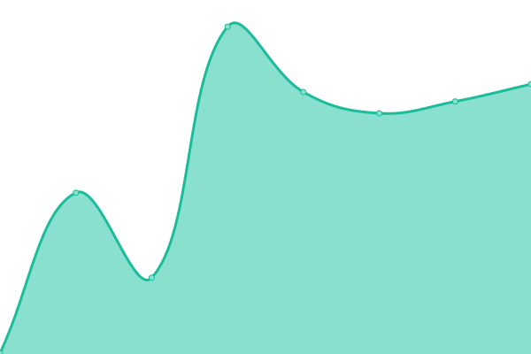 289ms
     
 | 

<a href="https://FP-Design-Code.github.io/uptime/history/youturn">100.00%</a>
    

<!--end: status pages-->

[**Visit our status website →**](https://upptime.github.io/upptime)

## 📄 License

- Powered by: [Upptime](https://github.com/upptime/upptime)
- Code: [MIT](./LICENSE) © [Upptime](https://upptime.js.org)
- Data in the `./history` directory: [Open Database License](https://opendatacommons.org/licenses/odbl/1-0/)
